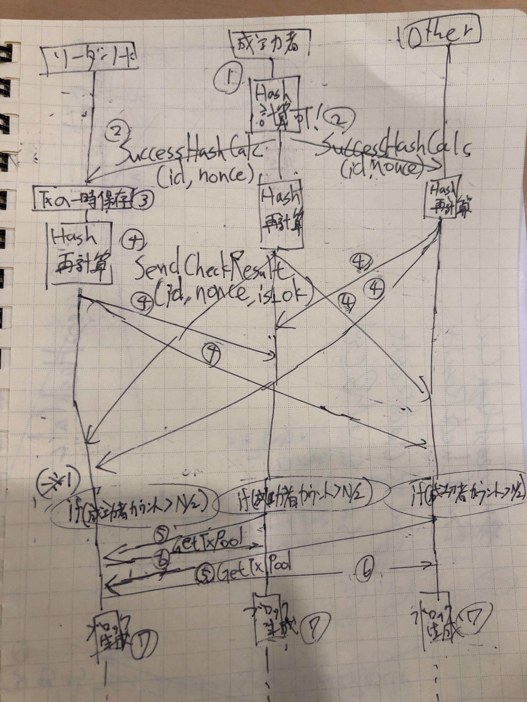

# 独自合意形成アルゴリズム `HEISEI` について

## 独自合意形成アルゴリズム `HEISEI` とは
- 独自合意形成アルゴリズム `HEISEI` とは、PoW (https://en.wikipedia.org/wiki/Proof-of-work_system) をベースに作成したEvilEye独自の合意形成アルゴリズム
- PoWでは、ハッシュ値の先頭が `0` のN個の連番にならなければならないところを、HEISEIアルゴリズムでは、平成初頭の日本のインターネット界隈を牽引してきた素晴らしき文字コードであるEUC_JPでの `"平"(0xCABF)`, `"成"(0xC0AE)` (ref. ) がビットパターンとして存在していればブロック作成の権利を得る

## 合意形成のフロー
大まかには以下のようなフローでブロック生成のための合意形成を行う

- 各ノードはバックグラウンドでひたすら計算をする
- 計算が成功したら、各ノードに合意形成がちゃんとできるかを他のノード全てに再確認(再計算)してもらう.
- 各ノードは再計算が終了したら、結果を他のノード全てに結果を送信する
- 計算を成功させたノード数が、 `N(全ノード数)/2` を上回ったら、そのリクエストのnonceで各ノードでブロックを生成する

以下で図とともに詳細を解説していく  

1. 各ノードはバックグラウンドでひたすらハッシュ計算をする
2. ブロック作成可能なハッシュ値を生成できたら(上図のシーケンス図で言うところの`成功者`)、各ノードの `SuccessHashCalc` (gRPCのメソッド)を叩き、ハッシュ成功を一意に決めるため `request_id` と `nonce` を各ノードに伝搬する
3. この際、リーダーノードはTxPoolにあるトランザクションをブロックとして固める予定のTxとして成功者から送られてきたIDと紐づけて保存しておく(これにより、時間差が生じて合意形成されてもすべてのノードに同じトランザクションを渡せる)
4. 各ノードは `SuccessHashCalc` でNonce、RequestID、を受け取った後、手元で再計算し、計算が終了したら `SendCheckResult` (gRPCのメソッド) を叩き、 `request_id`, `nonce`, `is_ok`(その計算が成功したか否かのbool値) とともに各ノードに成功か否かを伝える (※1. 各ノードは `SendCheckResult` を受け取ったとき、リクエスト内部の `is_ok` をもとに、可、不可それぞれを `request_id` ごとにカウントする)
5. 各ノードは、ハッシュ計算の成功のカウントが予め用意してあるしきい値(`N/2`)を超えた場合、ブロックを生成するために、リーダーノードのgRPCメソッド、 `GetTxPool` で3.で保存したTxをリーダーノードに問い合わせて取りに行く
6. リーダーノードは、予め3.で保存したTxを各ノードに返す。この際、合意形成が成功した場合は返すが、もしも不成功者のカウントがしきい値を超えた場合、3.で保存したTxはリーダーノードがもとに戻すことで、不整合が起こらないように合意形成が取れなかった際にもTxを処理する(つまり、次の合意形成の際にまとめて固めれるようにする)
7. ブロックを生成する

