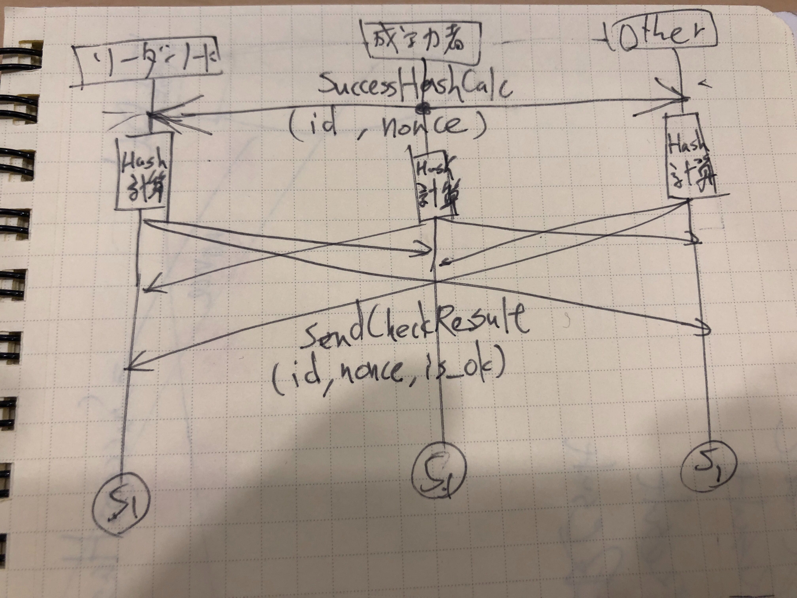
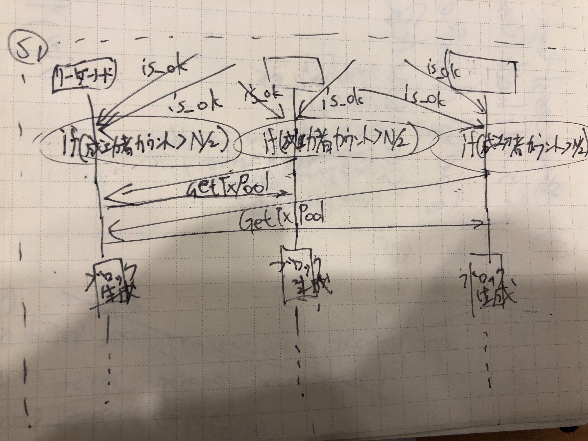

# 独自合意形成アルゴリズム `HEISEI` について

## 独自合意形成アルゴリズム `HEISEI` とは
独自合意形成アルゴリズム `HEISEI` とは、PoW (https://en.wikipedia.org/wiki/Proof-of-work_system) をベースに作成したEvilEye独自の合意形成アルゴリズム  
PoWでは、ハッシュ値の先頭が `0` のN個の連番にならなければならないところを、HEISEIアルゴリズムでは、平成初頭の日本のインターネット界隈を牽引してきた素晴らしき文字コードであるEUC_JPでの `"平"`, `"成"` がビットパターンとして存在していればブロック作成の権利を得る  

## 合意形成のフロー

- 各ノードはバックグラウンドでひたすらハッシュ計算をし、ブロック作成可能なハッシュ値を生成できたら、各ノードの `SuccessHashCalc` (gRPCのメソッド)を叩き、各ノードに伝搬する
- 各ノードは `SuccessHashCalc` でNonce、RequestID、を受け取り、手元で再計算し、計算が終了したら `SendCheck` (gRPCのメソッド) を叩き、各ノードに成功か否かを伝える

- ノードは `SuccessHashCalc` を受け取ったとき、リクエスト内部の `is_ok` をRequestIDごとにカウントし、ハッシュ計算の成功のカウントが予め用意してあるノード数に応じたしきい値を超えた場合に初めてブロックを生成する

